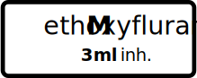
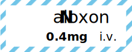
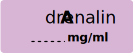

# Tall Man Medis - Syringe Label Generator

<p align="center">
  
  
  
  
</p>

A robust CLI tool and library for generating styled, ISO-compliant (ISO 26825 / DIVI) SVG syringe labels for medical use in critical care and anesthesia. 

It leverages the Gemini Pro API to automatically categorize medications into their appropriate standard color classes, predict standardized emergency bolus dosages vs. concentrations, and applies Tall Man lettering for increased safety. 

*Note: This tool is heavily tailored toward **German** standards (DIVI) first and **English** second.* This can be changes via the `--language-priority` option, see below for more.

## Quick Start (via NPM / Bunx)
If you have Bun installed, you don't even need to clone the repository. You can run the tool directly from the NPM registry using `bunx` (Bun's equivalent to `npx`):

```bash
export GEMINI_API_KEY="your-api-key-here"
bunx tall-man-medis -a "Adrenalin"
```

*(Note: Because this is a native TypeScript package, it requires `bunx` instead of `npx` to run successfully!)*

> I think deno would work as well, but havent tested it yet.

## Further Reading & Standards
- The official ISO for the colors: [ISO 26825:2020 - User-applied labels for syringes containing drugs used during anaesthesia](https://www.iso.org/standard/74033.html). I took the colors from [anaesthetists.org](https://anaesthetists.org/Portals/0/PDFs/Guidelines%20PDFs/Syringe%20labelling%202022%20v1.1.pdf?ver=2022-10-26-140938-370) (with a singular adjustment for benzodiazepines to make the dosage text color also white, as the spec doesnt make sense there IMO)
- [ISMP Tall Man Lettering Guide](https://online.ecri.org/hubfs/ISMP/Resources/ISMP_Look-Alike_Tallman_Letters.pdf)
- [Proposal of a Tall Man Letter list for German-speaking countries](https://pmc.ncbi.nlm.nih.gov/articles/PMC8275545/)

## Features
- **ISO Color Standards**: Automatically applies the correct background, text, and stripe colors based on standard anesthesia/critical care classifications.
- **LLM-Powered Categorization**: Uses the ultra-fast `@google/genai` API with parallel processing to intelligently classify a drug based on standard medical guidelines.
- **Intelligent Auto-Dosage & Routes**: Predicts both the standard unit (e.g., `mg`/`mcg`) and the standard absolute IV bolus dose, concentration structure, and administration route (e.g., `i.v.`, `inh.`) based on european emergency medicine standards.
- **Tall Man Lettering**: Uses internal libraries (German prioritized over English fallback) to safely format look-alike, sound-alike drug names (e.g., *AmiodarONE*).
- **Proportional SVG Layout**: Outputs clean, elastic, scalable `.svg` configurations directly. Uses explicit geometric math for cross-platform rendering (consistent in Safari, Chrome, and Figma).
- **API and CLI Integration**: Fast execution via Bun, or callable as a TypeScript library in other projects.

## Examples

You can review a large output of generated examples in the `example/withDoage` folder. Here are a few notable outcomes that demonstrate the power of the generation logic:

### 1. Complex Tall Man Translation (DiazePAM)
Correctly breaks out multiple uppercase spans and predicts a standard bolus dose + application route.
```bash
bunx tall-man-medis -a -r "diazepam"
```


### 2. Inhalation Route Prediction (Methoxyfluran)
Notice how the API correctly deduces that Methoxyfluran is an inhaled volatile agent, returning `3ml inh.` rather than a systemic mg dose!
```bash
bunx tall-man-medis -a -r "Methoxyfluran"
```


### 3. Antidotes (Naloxon, Flumazenil, Sugammadex)

- Automatic recognition: the generator detects common antidotes/antagonists (e.g., Naloxon, Flumazenil, Sugammadex) and tags them as "Antidote / Antagonist" to improve classification and labeling semantics.

```bash
bunx tall-man-medis -a -r "Naloxon"
```


### 4. Explicit Category Overrides (Brackets)
Sometimes the AI might categorize a medication differently than you expect, or an institution has non-standard class assignments. You can **force a specific categorization** by appending the classification in parentheses/brackets next to the drug name!

```bash
bunx tall-man-medis "Ketamine (Analgetikum)" "Adrenalin (Vasopressors)"
```
*(This entirely overrides the initial categorization step, meaning zero AI hallucination regarding the ISO standard color group!)*

### 5. Write-In / Blank Labels (Standard layout)
By default (without the `-a` flag), the tool generates generic labels with a standardized dotted line for manual dosage inputs.

```bash
bunx tall-man-medis "Adrenalin"
```



## Prerequisites
- [Bun](https://bun.sh/) (JavaScript runtime)
- A [Gemini API Key](https://aistudio.google.com/app/apikey).

## Local Setup (For Development)
1. Clone the repository.
2. Install dependencies:
   ```bash
   bun install
   ```
3. Set your API Key:
   ```bash
   export GEMINI_API_KEY="your-api-key-here"
   ```
   *(Alternatively, you can pass it via `--api-key` or `--api-key-file`)*

---

## Usage (CLI)

You can provide medications via a text file, a comma-separated string, or directly as positional arguments. Note: you can optionally append an explicit classification in parentheses!

**1. Direct arguments (Positional):**
```bash
bunx tall-man-medis Adrenalin Fentanyl "Propofol (Hypnotics)"
```

**2. Using a string flag:**
```bash
bunx tall-man-medis -m "Amiodaron, Ketamin, Midazolam"
```

**3. Using an input file:**
```bash
bunx tall-man-medis -f input_meds.txt
```

### Options

| Flag | Description | Default |
|------|-------------|---------|
| `-f, --medications-file <path>` | Path to the text/csv input file | `input_meds.txt` |
| `-m, --medications <string>` | Direct input as a comma-separated string | |
| `-l, --language-priority <german\|english>` | Base language to prioritize for Tall Man Lettering | `german` |
| `-o, --output <dir>` | Directory to save generated SVGs | `./labels` |
| `-a, --auto-dosage` | Fetch numerical dosages (e.g., `5 mg`) via API | `false` |
| `-C, --concentration` | Fetch concentration (e.g., `10 mg/ml`). (If `false`, uses absolute dose instead) | `false` |
| `-r, --route` | Include administration route (e.g. `i.v.`, `inh.`) next to the dosage/concentration | `false` |
| `-s, --scale <number>` | Scale multiplier for text padding. `1.0` is default size | `1.0` |
| `-S, --size-scale <number>` | Scale multiplier for the entire SVG size linearly | `1.0` |
| `-k, --api-key <string>` | Pass the Gemini API key as plaintext | |
| `-K, --api-key-file <path>`| Path to file containing the Gemini API key | |

Example with full layout options:
```bash
bunx tall-man-medis -a -r -C -S 0.9 -s 1.2 "Thiopental"
```

---

## Usage (Library)

You can import the core generator directly into any Node/Bun/TypeScript project:

```typescript
import { generateMediLabels } from './mkMediLabels';

await generateMediLabels({
    medications: [
        { name: "Fentanyl" },
        { name: "Propofol", userClass: "Hypnotics" } // Provide a hard "hint" bypassing random guesses
    ],
    apiKey: process.env.GEMINI_API_KEY,
    languagePriority: 'german',
    outputDir: "./custom_labels",
    autoDosage: true,    // Generate text sizes like "5 mg"
    concentration: true, // Use concentration format "10 mg/ml" 
    route: true,         // Append the route of administration, e.g. "i.v."
    scale: 1.0,          // Padding scale
    sizeScale: 0.9       // Scaled down linear SVG size
});
```
